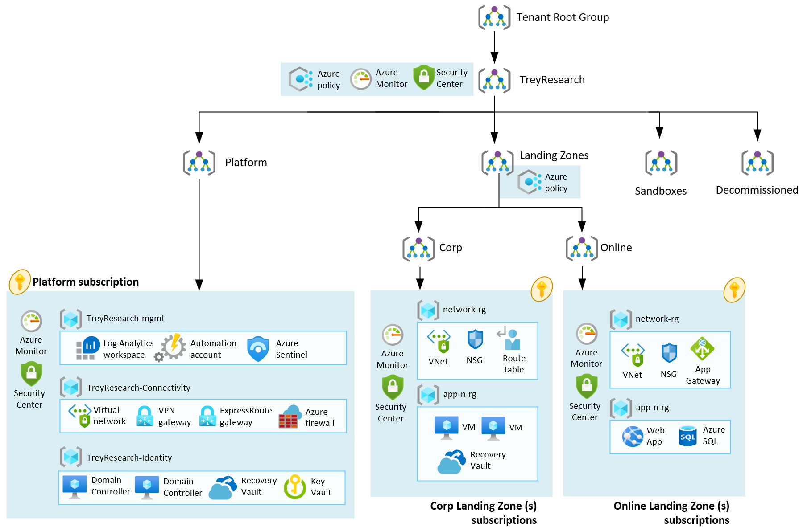

# trey-research-terraform

## TLDR

This is the terraform version of trey-research architecture that does not exist in the official repo.



## Motivation

Infrastructure becomes increasingly complex, multiple open source project offers layers on top of Terraform to simplify the complexity of installation but they do bring their fair share of complexity themselves as it requires additionnal training for your team, more layer to secure  and may create some difficulties to customize the template base.

This project intends to go back to the basics of Terraform and Infrastructure and show __the most simple__ of both so that it can be __easy to learn from it and customize it__. 

## Customer profile

This reference implementation provides a design path and initial technical state for Small and Medium Enterprises to start with foundational landing zones that support their application portfolios. This reference implementation is meant for organizations that do not have a large IT team and do not require fine grained administration delegation models. Hence, Management, Connectivity and Identity resources are consolidated in a single Platform Subscription.

This reference implementation is also well suited for customers who want to start with Landing Zones for their net new deployment/development in Azure by implementing a network architecture based on the traditional hub and spoke network topology.

https://github.com/Azure/tfmod-scaffold

## Try locally

Notice : This is fast and accessible, but the state of terraform is stored locally and this is bad (= not for teams &| prod)

Prerequisites : You only need last version of AzCli and Terraform executable.

```
az login
az account set --subscription "subscription-id"
terraform init
terraform apply -var-file="testing.tfvars"
```

To remove everything :

```
terraform apply -var-file="testing.tfvars" -destroy
```

*How this can be improved* : As you can see, each developper would have to setup his own dev environment and this may lead to some inconsistencies and errors. To solve this, a dev environment defined in a container, that can be used in Visual Studio Code dev container extension is ideal. you can go even further and user a Terraform wrapper : This is what [Rover](https://learn.microsoft.com/en-us/azure/cloud-adoption-framework/ready/landing-zone/terraform-landing-zone#rover) is about.

## Industrialize

Manual is cool to start with but we are facing multiple problems : 
- Governance : What is the company is going to do when you are on vacation
- Security : How can we improve security on our password secrets at least
- Monitoring : how to troubleshot and keep historization of our change

To stick to our __minimum viable product__, the intent here is to :
- Use a CICD pipeline to execute terraform actions
- Save Terraform state within an Azure Storage Account

### Steps :
__[section in progress]__

Notice : We add an Azure storage account for state management and a service principal that is going to execute terraform. This makes the execution possible within a CICD pipeline.

To do once : 
```
az ad sp create-for-rbac --role="Contributor" --scopes="/subscriptions/<SUBSCRIPTION_ID>"

$Env:ARM_CLIENT_ID = "<APPID_VALUE>"
$Env:ARM_CLIENT_SECRET = "<PASSWORD_VALUE>"
$Env:ARM_SUBSCRIPTION_ID = "<SUBSCRIPTION_ID>"
$Env:ARM_TENANT_ID = "<TENANT_VALUE>"
```
